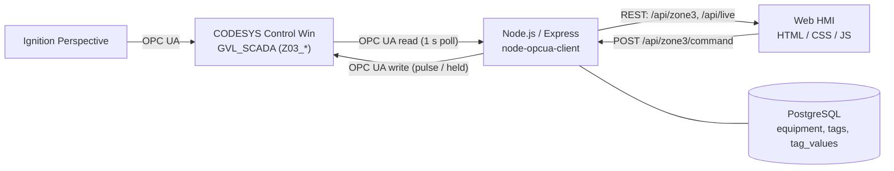

# Web HMI with OPC UA Integration — CODESYS → Node.js → Browser

A custom web-based SCADA/HMI for a building irrigation process. A Node.js service connects to a **CODESYS Control Win** runtime over **OPC UA**, reads live process data, and sends operator commands back to the PLC. A browser HMI shows Zone 03 live and controls it. PostgreSQL holds the equipment and tag configuration.

This is the web layer of the [Water Process Integration Testbed](../README.md). The same CODESYS runtime is also consumed by an **Ignition Perspective** project, so two independent OPC UA clients work against one PLC.

> Screenshots and a short screen recording are in `media/`.

---

## Architecture



The browser cannot speak OPC UA, so Node.js sits in the middle: it owns the single PLC session, keeps the latest values in memory, and exposes them over REST.

---

## What is live and what is not

| Area | Source |
|---|---|
| Zone 03 moisture, flow, valve, status | **Live** from CODESYS (`GVL_SCADA`, `Z03_*`) |
| Zone 03 Start / Stop / Auto-Manual / Fault Reset | **Live** writes to CODESYS |
| Equipment and tag configuration | PostgreSQL |
| Water tank, pump P-01, main header, Zones 01, 02, 04–06 | Local values in `js/tags.js` — no PLC I/O yet |

Zone 03 is the only zone with PLC logic so far. Other zones will follow when their PLC programs (Siemens, Rockwell) are connected.

---

## Features

- Automatic discovery of every variable in `GVL_SCADA` (OPC UA browse), so new PLC tags appear in `/api/live` without code changes
- 1-second polling of all tags with a single OPC UA read call
- Operator commands with a **whitelist** — only five named commands can reach the PLC, never arbitrary tags
- **Server-side interlocks** that mirror the PLC logic, with clear error messages instead of silently ignored commands
- HMI buttons that enable or disable from live PLC state (for example, Start is only available in MANUAL, with permissive, when not running)
- `NO DATA` status on the HMI when the backend or PLC connection is lost

---

## PLC interface

Zone 03 logic runs in a CODESYS function block: moisture hysteresis for AUTO demand, a permissive chain, a latched fault, and a Stop command that always wins.

**Commands (web → PLC)**

| API command | PLC tag | Write type | Reason |
|---|---|---|---|
| `start` | `Z03_START` | Pulse (300 ms) | PLC uses `R_TRIG` — needs a rising edge |
| `stop` | `Z03_STOP` | Pulse (300 ms) | Same |
| `faultReset` | `Z03_FAULT_RESET` | Pulse (300 ms) | Same |
| `auto` / `manual` | `Z03_AUTO` | Held `TRUE` / `FALSE` | Mode is a level, not an event |

`Z03_MANUAL` is a PLC output (`NOT xAuto`) and is never written.

**Interlocks enforced by the API**

- `start` → only in MANUAL, only when `Z03_PERMISSIVE` is true, only when not already running
- `stop`, `faultReset`, mode changes → always allowed

**Key status tags (PLC → web):** `Z03_RUNNING`, `Z03_FAULT`, `Z03_PERMISSIVE`, `Z03_AUTO`, `Z03_MOISTURE`, `Z03_FLOW`, `Z03_VALVE`, `Z03_MOISTURE_LOW_SP`, `Z03_MOISTURE_HIGH_SP`

---

## REST API

| Method | Endpoint | Description |
|---|---|---|
| GET | `/api` | Health check |
| GET | `/api/equipment` | Equipment list from PostgreSQL |
| GET | `/api/tags` | Tag configuration joined with equipment |
| GET | `/api/tags/:tagName/value` | Latest stored value for a tag |
| GET | `/api/zone3` | Live Zone 03 values (flat object) |
| GET | `/api/live` | All live `GVL_SCADA` tags |
| POST | `/api/zone3/command` | Send a command: `{ "command": "start" }` |

Command errors return `409` for interlock violations, `503` when OPC UA is not connected, and `502` when the PLC rejects a write.

---

## Project structure

```
index.html            HMI page
css/                  styles
js/tags.js            HMI logic, live Zone 03 polling, command buttons
server/server.js      Express API
server/opcua.js       OPC UA client: browse, poll, write, interlocks
server/database.js    PostgreSQL connection
database/schema.sql   equipment, tags, tag_values
PLC/                  CODESYS project files
```

---

## Getting started

**Requirements:** Node.js, PostgreSQL, CODESYS with the Control Win SoftPLC running an OPC UA server.

1. In CODESYS, add a Symbol Configuration that exposes `GVL_SCADA`. Set `Z03_START`, `Z03_STOP`, `Z03_FAULT_RESET` and `Z03_AUTO` to **Read/Write**.
2. Create the database and run `database/schema.sql`.
3. Create a `.env` file with your PostgreSQL connection settings (see `server/database.js`).
4. Set the OPC UA endpoint in `server/opcua.js` (`ENDPOINT`, default `opc.tcp://127.0.0.1:4840`).
5. Install and start:
   ```
   npm install
   node server/server.js
   ```
6. Open `index.html` with a local web server (for example the VS Code Live Server extension).

Check the API first: `http://localhost:3000/api/live` should list all `Z03_*` tags.

---

## Engineering notes

- **Endpoint discovery vs. direct connect.** A separate `getEndpoints()` discovery call was closed by the CODESYS server ("No SecureChannel"). Connecting directly with a fixed security mode worked, so the client connects directly.
- **Edge-triggered commands.** Holding `Z03_START` true would never re-trigger the PLC. The API sets the tag, waits 300 ms (several PLC scans), then releases it in a `finally` block so a failed write cannot leave the tag stuck.
- **Single source of truth for rules.** The PLC decides what is allowed. The API repeats the same rules only to give the operator a clear message.
- **STOP in AUTO.** Stop clears the current demand, but AUTO will start the zone again when moisture falls to the low setpoint. This is PLC behavior, not an HMI bug.

---

## Known limitations and next steps

- OPC UA uses security mode **None** with an anonymous session, and the API has no authentication and open CORS. Fine for a local test setup; this must change before connecting real equipment (Basic256Sha256 with certificates, user login).
- No automatic OPC UA reconnect yet — the Node service must be restarted if the PLC runtime restarts.
- Commands are not logged yet. Next step: write each command to PostgreSQL with an operator name and source.
- Live values are not yet historized into `tag_values`.
- Zones 01, 02, 04–06, the tank and pump P-01 are not connected to PLC I/O.

